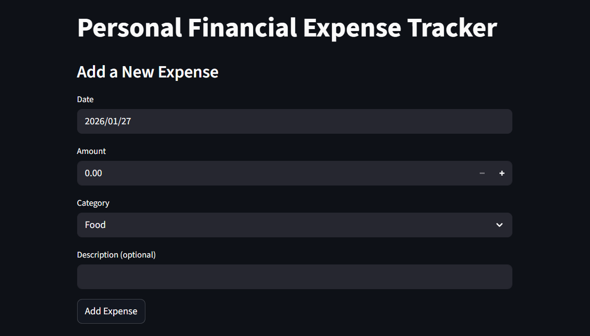
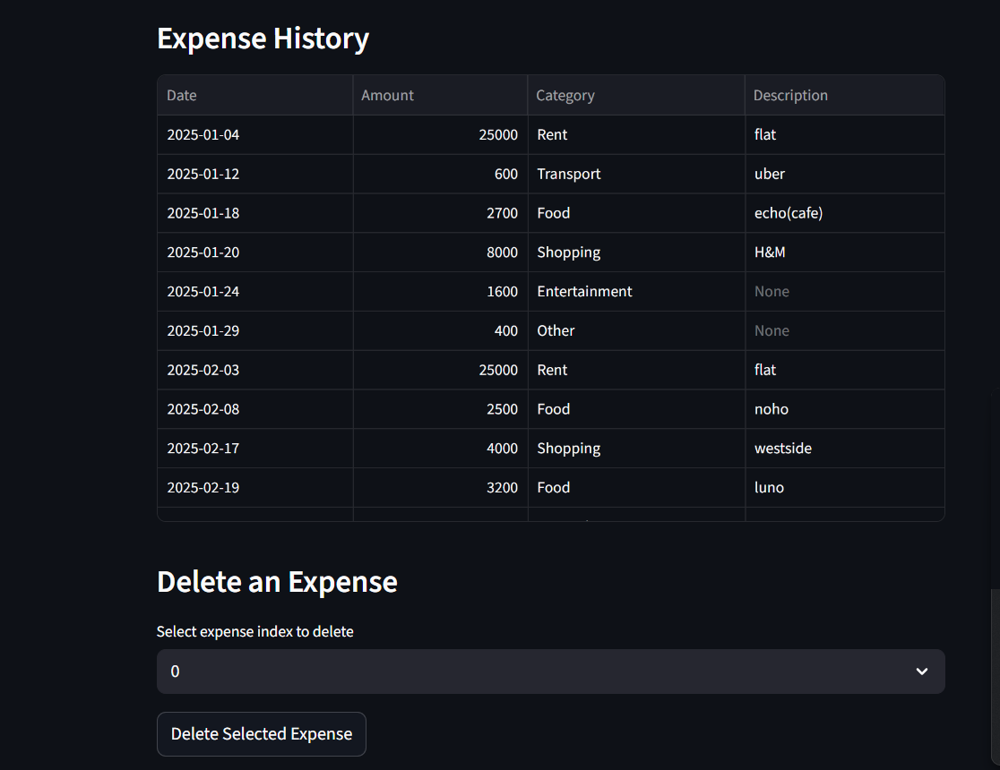
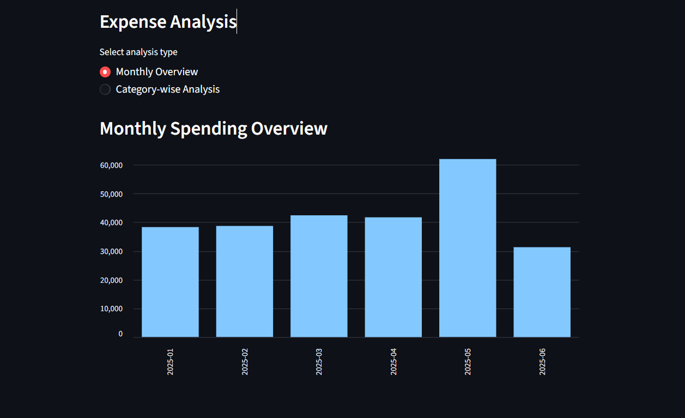
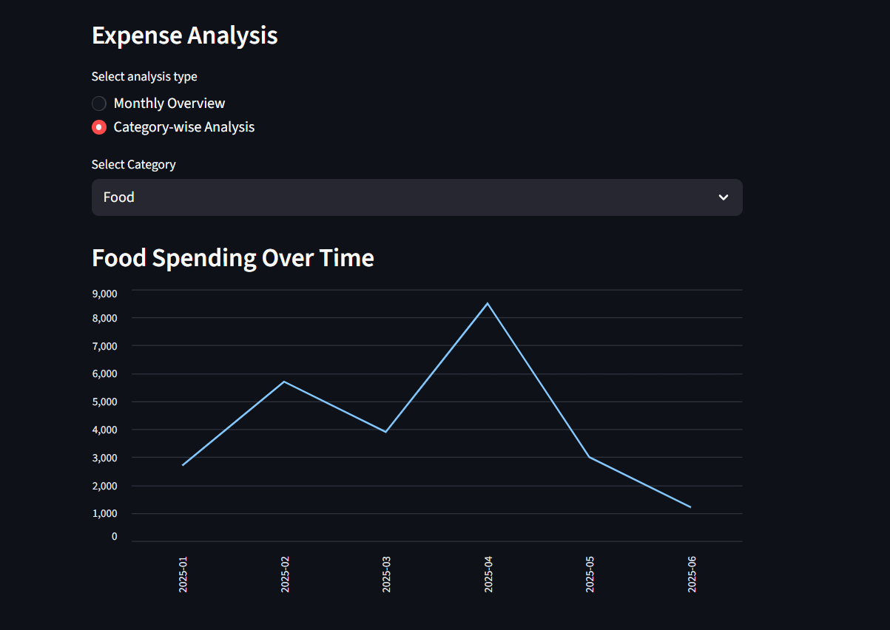

## Personal Financial Expense Tracker 

A Python-based personal finance dashboard built using **Streamlit** and **Pandas**. The application allows users to record daily expenses and analyze spending patterns through interactive charts.

---

## Demo

### Expense History & Entry



### Monthly Spending Overview


### Category-wise Analysis (Examples)



---

## Features
- Add expenses with date, amount, category, and description
- Persistent storage of data using CSV
- View complete expense history in tabular form
- Delete individual expense records
- Monthly spending overview using bar charts
- Category-wise spending analysis
- Interactive line charts to visualize spending trends over time

---

## Tech Stack

- Python
- Streamlit
- Pandas

---

## How to Run Locally

1. Clone the repository:
```bash
https://github.com/RajaniMopidevi/personal-financial-expense-tracker.git
```

2. Install dependencies:
```bash
pip install -r requirements.txt
```

3. Run the Streamlit app:
```bash
streamlit run app.py 
```
(or)
```bash
python -m streamlit run app.py
```

---

## Project Structure
```text
personal-financial-expense-tracker/
│
├── app.py                # Main Streamlit application (UI)
├── utils.py              # Data handling and business logic
├── expenses.csv          # Expense data storage
├── requirements.txt      # Project dependencies
├── assets/               # Screenshots used in README
│ ├── add_expense.png
│ ├── expense_history.png
│ ├── monthly_overview.png
│ ├── category_analysis_food.png
│ └── category_analysis_shopping.png
└── README.md             # Project documentation
```

---

## What I Learned
- Building an end-to-end data-driven application in Python
- Using Pandas for data manipulation and aggregation
- Creating interactive dashboards with Streamlit
- Structuring and documenting a complete project
  
---

## Future Improvements
- Add summary metrics (total spend, highest category, monthly average)
- Add month-based filters
- Export expense data as CSV
- Enhance UI with improved styling and layout
